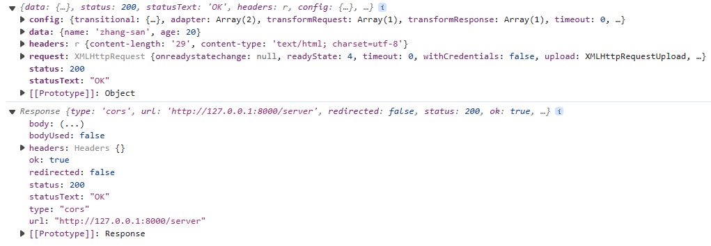

# Axios

## 基本使用

### GET

```js
// axios
axios("http://127.0.0.1:8000/server").then((res) => {
  console.log(res);
});

// fetch
fetch("http://127.0.0.1:8000/server").then((res) => {
  console.log(res);
});
```

与 `fetch` 一样，`axios()` 也返回一个 `promise` 对象，当不指定方法时，默认发送 `GET` 请求。

### POST

`axios` 也可以如 `fetch` 一样的方式发送 `POST` 请求 —— 传入第二个参数，这个参数是个配置对象，将配置对象 `method` 属性改为 `post`

```js
//axios
axios("http://127.0.0.1:8000/server", {
  method: "post",
}).then((res) => {
  console.log(res);
});

// fetch
fetch("http://127.0.0.1:8000/server", {
  method: "post",
}).then((res) => {
  console.log(res);
});
```

`axios` 也可以只传入一个配置对象作为参数，将 `url` 也作为配置项写入配置对象

```js
axios({
  url: "http://127.0.0.1:8000/server",
  method: "post",
}).then((res) => {
  console.log(res);
});
```

#### 设置请求体

`fetch` 使用 `body` 选项设置请求体
`axios` 使用 `data` 选项设置请求体，且会自动转化为 JSON 格式

```js
const user = {
  name: "zhangsan",
  age: 18,
};

fetch("http://127.0.0.1:8000/server", {
  method: "post",
  // body
  body: JSON.stringify(user),
});

axios({
  url: "http://127.0.0.1:8000/server",
  method: "post",
  // data
  data: user,
});
```

### 别名

`axios` 还为请求提供了别名

- `axios.get(url[, config])`
- `axios.post(url[, data[, config]])`

```js
// get
axios.get("http://127.0.0.1:8000/server");
// post
axios.post("http://127.0.0.1:8000/axios", user);
```

使用别名时，`url`, `method`, `data` 都不必在 配置对象中配置

```js
axios.post({
  url: "http://127.0.0.1:8000/axios",
}); // 报错
```

## 获取响应体

`axios` 与 `fetch` 的获取响应体方法不同



`fetch` 无法直接拿到响应体，需调用 `Response` 上的 `.text()` `.json()` 等方法对结果进行解析
`axios` 会自动解析响应体。

```js
// axios
axios("http://127.0.0.1:8000/server").then((res) => {
  console.log(res.data); // {name: 'zhang-san', age: 20}
});

// fetch
fetch("http://127.0.0.1:8000/server")
  .then((res) => {
    return res.json();
  })
  .then((res) => {
    console.log(res); // {name: 'zhang-san', age: 20}
  });
```

## 配置项

[中文文档](https://www.axios-http.cn/docs/req_config)

## 创建实例对象

`axios` 可以使用自定义配置创建实例对象来发送请求，在需要发送不同域名的请求时使用更方便
`axios.create(config)`

```js
const instance = axios.create({
  baseURL: "http://127.0.0.1:8000",
  timeout: 3000,
});

instance.post("/axios", {
  name: "zhang_san",
  age: 18,
});
instance.get("/server", {
  params: {
    id: "001",
  },
});
```

## 默认配置

`axios` 可以设置默认配置，将作用于每个请求

```js
axios.defaults.baseURL = "http://127.0.0.1:8000";

axios.get("/server");
axios.post("/axios");
```

`axios` 实例在创建时设置默认配置
