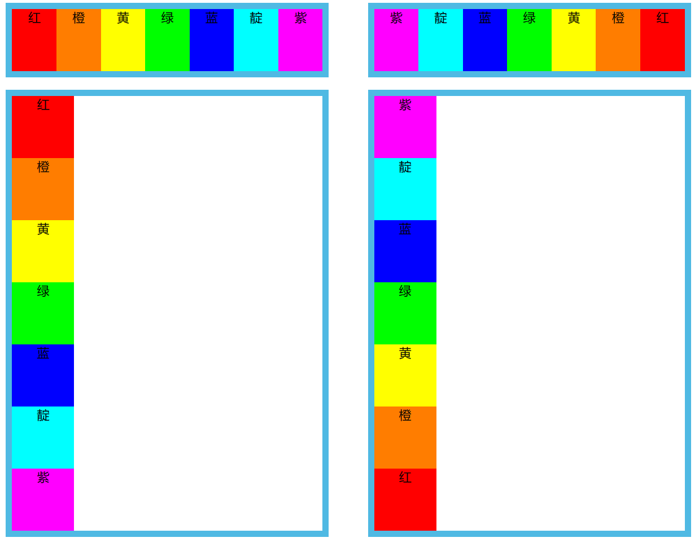
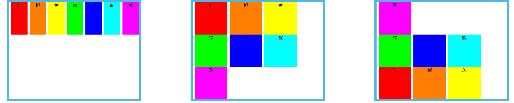
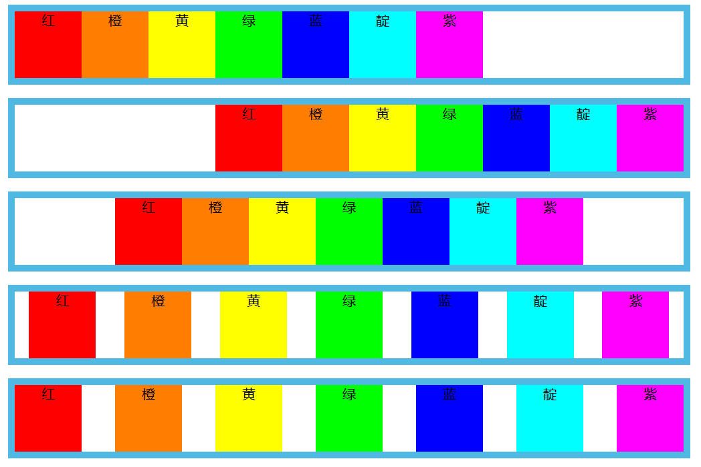
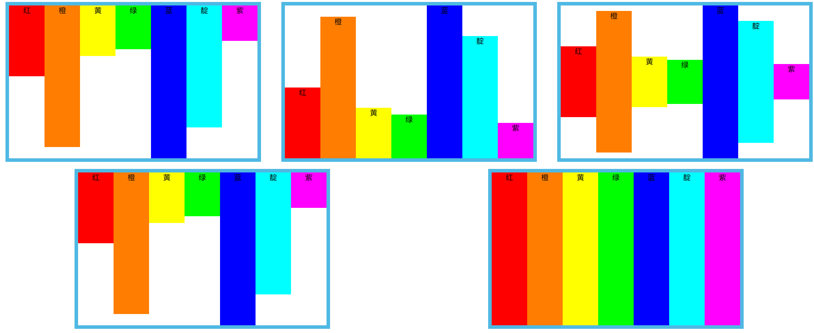
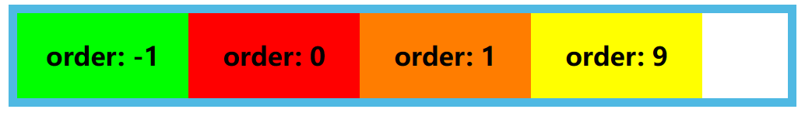
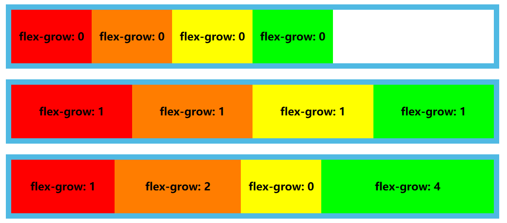
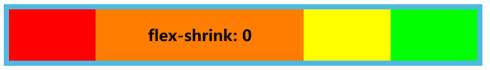

# Flex 基本使用

## flex 容器和 flex 项目

- flex 容器：使用 flex 布局的元素称为 flex 容器（flex container）
  - 开启方法：`display: flex`
- flex 项目：flex 容器的所有直接子元素自动成为容器成员，称为 flex 项目（flex item）

## flex 容器属性

::: tip
六个容器属性：

- `flex-direction`
- `flex-wrap`
- `flex-flow`
- `justify-content`
- `align-items`
- `align-content`

:::

### `flex-direction`

- 作用：决定主轴方向
- `flex-direction: row | row-reverse | column | column-reverse;`
  - `row`（默认值）：主轴为水平方向，起点在左端。
  - `row-reverse`：主轴为水平方向，起点在右端。
  - `column`：主轴为垂直方向，起点在上沿。
  - `column-reverse`：主轴为垂直方向，起点在下沿。

### `flex-wrap`

- 作用：定义如何换行
- `flex-wrap: nowrap | wrap | wrap-reverse;`
  - `nowrap`（默认）：不换行。
  - `wrap` 换行，第一行在上方
  - `wrap-reverse` 换行，第一行在下方

### `flex-flow`

- `flex-direction` 属性和 `flex-wrap` 属性的简写形式，默认值为 `row nowrap`。

### `justify-content`

- 作用：定义了项目在主轴上的对齐方式。
- `justify-content: flex-start | flex-end | center | space-around | space-between`
  - `flex-start`（默认值）：左对齐
  - `flex-end`：右对齐
  - `center`： 居中
  - `space-around`：每个项目两侧的间隔相等。所以，项目之间的间隔比项目与边框的间隔大一倍。
  - `space-between`：两端对齐，项目之间的间隔都相等。

### `align-items`

- 作用：定义项目在交叉轴上如何对齐方式。
- `align-items: flex-start | flex-end | center | baseline | stretch`
  - `flex-start`：交叉轴的起点对齐。
  - `flex-end`：交叉轴的终点对齐。
  - `center`：交叉轴的中点对齐。
  - `baseline`: 项目的第一行文字的基线对齐。
  - `stretch`（默认值）：如果项目未设置高度或设为 auto，将占满整个容器的高度。

### `align-content`

- 作用：定义了多根轴线的对齐方式。如果项目只有一根轴线，该属性不起作用。
  - `flex-start`：与交叉轴的起点对齐。
  - `flex-end`：与交叉轴的终点对齐。
  - `center`：与交叉轴的中点对齐。
  - `space-between`：与交叉轴两端对齐，轴线之间的间隔平均分布。
  - `space-around`：每根轴线两侧的间隔都相等。所以，轴线之间的间隔比轴线与边框的间隔大一倍。
  - `stretch`（默认值）：轴线占满整个交叉轴。

### `gap`

- 作用：更为方便的设置项目在主轴的边距

## flex 项目属性

六个项目属性
::: tip

- `order`
- `flex-grow`
- `flex-shrink`
- `flex-basis`
- `flex`
- `align-self`
  :::

### `order`

- 定义项目的排列顺序。数值越小，排列越靠前，默认为 0。

### `flex-grow`

- 定义项目的放大比例，默认为 0，即如果存在剩余空间，也不放大。

### `flex-shrink`

- 定义了项目的缩小比例，默认为 1，即如果空间不足，该项目将缩小。

### `flex-basis`

- 定义了在分配多余空间之前，项目占据的主轴空间（main size）。浏览器根据这个属性，计算主轴是否有多余空间。它的默认值为 `auto`，即项目的本来大小。
- 它可以设为跟 `width` 或 `height` 属性一样的值（比如 350px），则项目将占据固定空间。

### `flex`

- `flex-grow`, `flex-shrink` 和 `flex-basis` 的简写，默认值为 `0 1 auto`。后两个属性可选。
- `align-self`
  - 允许单个项目有与其他项目不一样的对齐方式，可覆盖 `align-items` 属性。默认值为 `auto`，表示继承父元素的 `align-items` 属性，如果没有父元素，则等同于 stretch。
