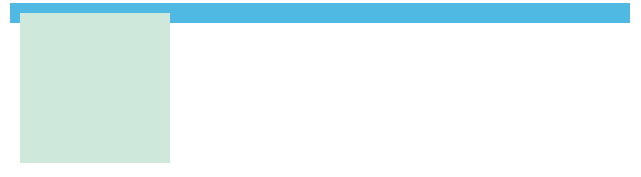

# 清除浮动带来的高度塌陷

## 父元素高度塌陷原因

float 使元素脱离文档流，导致父元素高度没有办法被撑起

```css
.wrapper {
  width: 600px;
  margin: 0 auto;
  border: 10px solid #4fb9e3;
}

.box {
  width: 150px;
  height: 150px;
  background-color: #cfe8dc;
}
```

```html
<div class="wrapper">
  <div class="box"></div>
</div>
```

`.box` 浮动前，父元素高度由它撑起

<!--  -->

<!--  -->

给 `.box` 添加浮动后，父元素高度塌陷

<!--  -->


```css
.box {
  width: 150px;
  height: 150px;
  background-color: #cfe8dc;
  /* 给 `.box` 添加浮动后，父元素高度塌陷 */
  float: left;
}
```

## clearfix 技巧

原理：给父元素添加一个子元素，子元素清除浮动来消除塌陷。

::: tip
`::after` 用来创建一个伪元素，作为已选中元素的最后一个子元素
:::

```css
.wrapper {
  width: 600px;
  margin: 0 auto;
  border: 10px solid #4fb9e3;
}

.box {
  width: 150px;
  height: 150px;
  background-color: #cfe8dc;
  float: left;
}

.clearfix::after {
  content: "";
  clear: both;
  display: block;
}
```

```html
<div class="wrapper clearfix">
  <div class="box"></div>
</div>
```

## overflow

将父元素的 `overflow` 属性设置为 `auto`

```css
.wrapper {
  width: 600px;
  margin: 0 auto;
  border: 10px solid #4fb9e3;
  /* 将父元素的 `overflow` 属性设置为 `auto` */
  overflow: auto;
}
```

```html
<div class="wrapper">
  <div class="box"></div>
</div>
```

## display: flow-root

将父元素的 `display` 属性设置为 `flow-root`

```css
.wrapper {
  width: 600px;
  margin: 0 auto;
  border: 10px solid #4fb9e3;
  /* 将父元素的 `overflow` 属性设置为 `auto` */
  display: flow-root;
}
```

```html
<div class="wrapper">
  <div class="box"></div>
</div>
```
