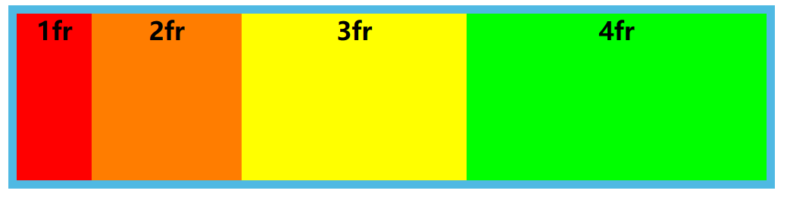
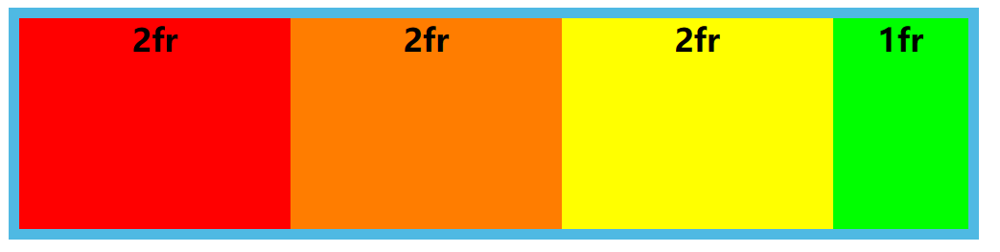
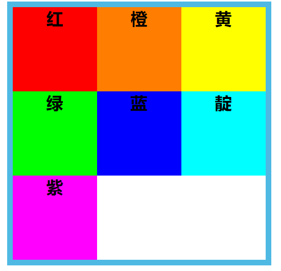
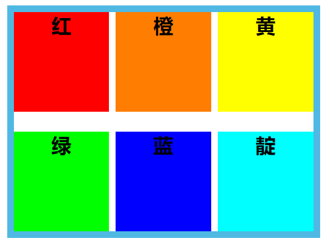
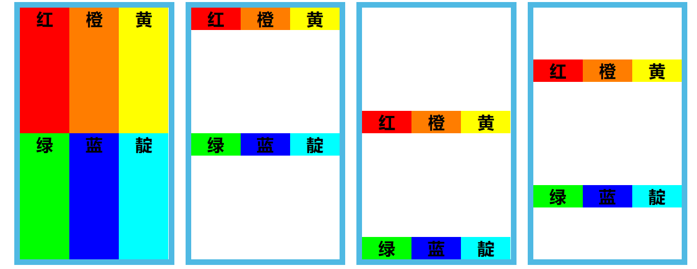
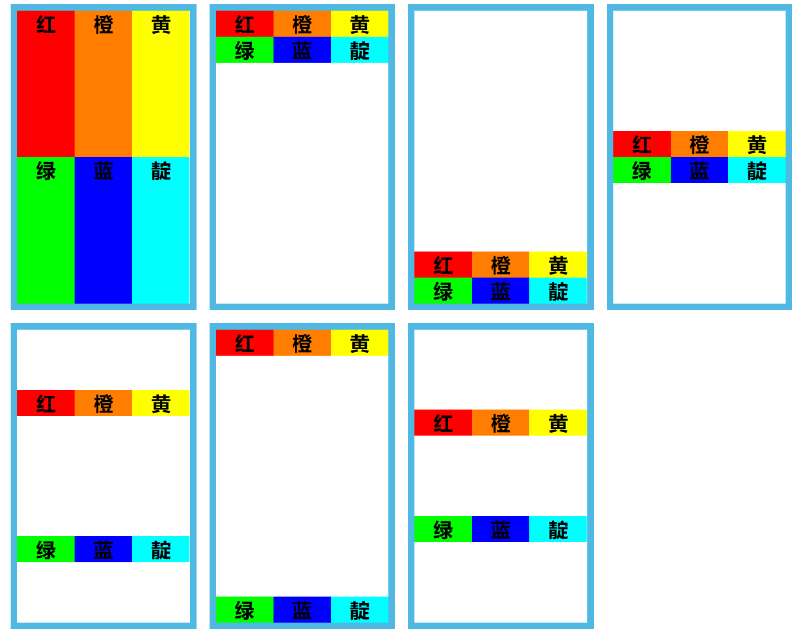
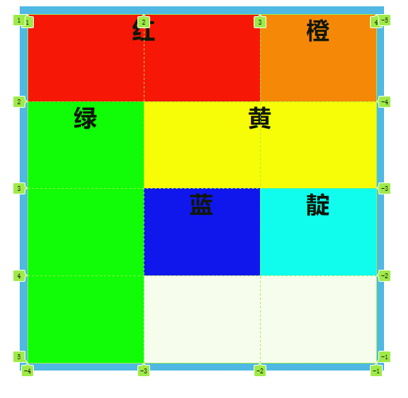
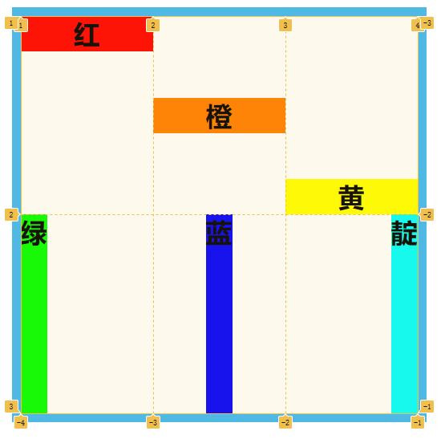

# Grid 基本使用

## grid 容器属性

::: tip

- `grid-template-cloumns`
- `grid-template-rows`
- `row-gap`
- `column-gap`
- `justify-items`
- `align-items`
- `justify-content`
- `align-content`
  :::

### `grid-template-cloumns` 和 `grid-template-rows`

- `grid-template-cloumns`：分别定义每一列的列宽
- `grid-template-row`：分别定义每一行的行高
- `fr` 关键字：表示比例关系，如果两列的宽度分别为 `1fr` 和 `2fr`，就表示后者是前者的两倍。

```css
.grid-container {
  grid-template-columns: 1fr 2fr 3fr 4fr;
}
```



- `repeat()`：接受两个参数，第一个参数是重复的次数，第二个参数是所要重复的值。

```css
.grid-container {
  grid-template-columns: repeat(3, 2fr) 1fr;
}
```



表示前三个项目占据 `2/7` 宽度，最后一个项目占据 `1/7` 宽度

当项目数多余 `repeat()` 第一个参数时会自动换行

```css
.grid-container {
  grid-template-columns: repeat(3, 1fr);
}
```



### gap

- `row-gap`：设置行与行的间隔（行间距）
- `column-gap`：设置列与列的间隔（列间距）
- `gap`：`row-gap` 与 `cloumn-gap` 的合并简写形式，如果 `gap` 省略了第二个值，浏览器认为第二个值等于第一个值。

```css
.grid-container {
  gap: 30px 10px;
}
```



### justify-items 和 align-items

- `justify-items` 设置单元格内容的水平位置
- `align-items` 属性设置单元格内容的垂直位置
  - 两个属性取值有以下几种
    - `stretch`：拉伸，占满单元格的整个宽度（默认值）。
    - `start`：对齐单元格的起始边缘。
    - `end`：对齐单元格的结束边缘。
    - `center`：单元格内部居中。



### justify-content 和 align-content

- `justify-content` 属性是整个内容区域在容器里面的水平位置
- `align-content` 属性是整个内容区域的垂直位置
  - 两个属性取值有以下几种
    - `stretch` - 项目大小没有指定时，拉伸占据整个网格容器（默认值）。
    - `start` - 对齐容器的起始边框。
    - `end` - 对齐容器的结束边框。
    - `center` - 容器内部居中。
    - `space-around` - 每个项目两侧的间隔相等。所以，项目之间的间隔比项目与容器边框的间隔大一倍。
    - `space-between` - 项目与项目的间隔相等，项目与容器边框之间没有间隔。
    - `space-evenly` - 项目与项目的间隔相等，项目与容器边框之间也是同样长度的间隔。



## grid 项目属性

::: tip

- `grid-column`
- `grid-row`
- `justify-self`
- `align-self`
  :::

### grid-column 和 grid-row

用于指定项目的位置，从哪根网格线到哪根网格线

- 语法：

  - `grid-column: <start-line> / <end-line>;`
  - `grid-row: <start-line> / <end-line>;`
  - 当项目跨越整行/整列时，第二个数字可以指定为 `-1`
  - 也可以使用 `span` 关键字，表示跨越多少个网格

```css
.red {
  grid-column: 1 / 3;
}

.yellow {
  grid-column: 2 / -1;
}

.green {
  grid-row: 2 / span 3;
}
```



借助图片清楚看出它是如何运作。

### justify-self 和 align-self

设置单个盒子在其布局容器中的对其方式。

```css
.red {
  align-self: start;
}

.orange {
  align-self: center;
}

.yellow {
  align-self: end;
}

.green {
  justify-self: start;
}

.blue {
  justify-self: center;
}

.cyan {
  justify-self: end;
}
```


