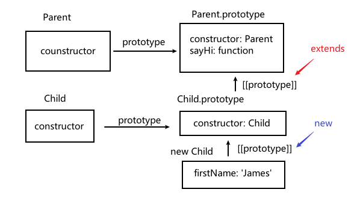

# 类继承

## extend

类通过关键字 `extends` 继承
`class Child extends Parent`
假设我们有 class Parent

```javascript
class Parent {
  constructor(firstName) {
    this.firstName = firstName;
  }
  sayHi() {
    console.log(`我们是${this.firstName}家族`);
  }
}

class Child extends Parent {}

let child = new Child("James");
console.log(child.__proto__ === Child.prototype); // true
console.log(Child.prototype.__proto__ === Parent.prototype); // true
```

`extends` 关键字的作用就是 `Child.prototype.__proto__ = Parent.prototype`，

这样一来：

- `child.__proto__ === Child.prototype`
  - 这是 `new` 得来的，实例对象的 `[[prototype]]` 指向构造函数的 `prototype`
- `Child.prototype.__proto__ === Parent.prototype`
  - 这是 `extends` 关键字的作用
- `child` 实例找不到的属性方法顺着原型链来到 `Child.prototype`，再来到 `Parent.prototype`



## super

- `super.method()` 调用一个父类方法
- `super()` 调用一个父类 `constructor`

### 重写方法

有时候我们希望调整或扩展父类的方法，在此过程中会调用父类方法。

```javascript
class Parent {
  constructor(firstName) {
    this.firstName = firstName;
  }
  sayHi() {
    // console.log(`我们是${this.firstName}家族`);
    return `我们是${this.firstName}家族`;
  }
}

class Child extends Parent {
  sayHi() {
    // `super.method()` 调用一个父类方法
    const msg = super.sayHi();
    console.log(`大家好，${msg}`);
  }
}

let child = new Child("James");
child.sayHi(); // "大家好，我们是James家族"
```

### 重写 constructor

到现在为止，我们还未给 `Child` 添加自己的 `constructor`，如果一个类没有自己 `constructor`，那么它会调用父类的 `constructor`，并传递所有参数

```javascript
class Parent {
  constructor(firstName) {
    this.firstName = firstName;
  }
}

class Child extends Parent {
  // 调用父类的 `constructor`
  // constructor(firstName) {
  //   this.firstName = firstName;
  // }
}

const child = new Child("James");
console.log(child.firstName); // 'James'
```

现在我们为 `Child` 添加自己的 `constructor`，除了 `firstName` 以外，添加 `lastName` 属性

```javascript
class Parent {
  constructor(firstName) {
    this.firstName = firstName;
  }
  sayHi() {
    console.log(`我们是${this.firstName}家族`);
  }
}

class Child extends Parent {
  constructor(firstName, lastName) {
    this.firstName = firstName;
    this.lastName = lastName;
  }
}

const child = new Child("James", "Bond"); //Must call super constructor in derived class before accessing 'this' or returning from derived constructor
```

结果却报错了。

**继承类的 `constructor` 必须要在使用 `this` 之前调用 `super(...)`**。
这是因为继承类的 `constructor` 执行时，会期望父类的 `constructor` 来进行 `this` 创建的工作。

所以派生的 `constructor` 必须调用 `super` 才能执行其父类的 `constructor`，否则 `this` 指向的那个对象将不会被创建。

```javascript
class Parent {
  constructor(firstName) {
    this.firstName = firstName;
  }
  sayHi() {
    console.log(`我们是${this.firstName}家族`);
  }
}

class Child extends Parent {
  constructor(firstName, lastName) {
    super(firstName);
    this.lastName = lastName;
  }
}

const child = new Child("James", "Bond");
console.log(child.firstName, child.lastName); // James Bond
```

## 总结

- `class Child extends Parent` 表示 `Child.prototype.__proto__`指向 `Parent.prototype`，正因如此，才能实现类继承
- 重写 `constructor`：
  - 必须要在使用 `this` 之前调用 `super(...)`
- 重写方法：
  - 可以在 `Child` 方法中使用 `super.method()` 调用 `Parent` 方法
