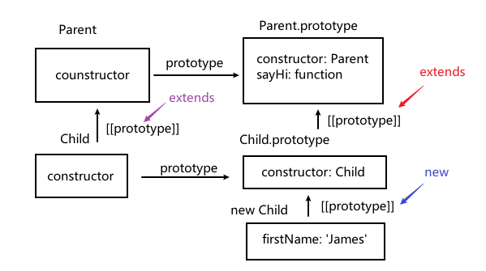

# 静态方法

## 静态方法

当一个方法属于整个类，而不是类的实例时，这个方法就是静态的。在声明中，它们以 `static` 开头

```javascript
class User {
  static sayHi() {
    console.log("我是一个静态方法");
  }
}

User.sayHi(); // 我是一个静态方法
```

实际上，它跟以下代码等价。

```javascript
class User {}

User.sayHi = function () {
  console.log("我是一个静态方法");
};
```

静态方法可以在类上调用，而不是在单个对象上。

```javascript
class User {
  static sayHi() {
    console.log("我是一个静态方法");
  }
}

User.sayHi(); // 我是一个静态方法

const user = new User();
user.sayHi(); // user.sayHi is not a function
```

## 继承静态方法

静态方法是可以被继承的

```javascript
class Person {
  static sayHi() {
    console.log("我是一个静态方法");
  }
}

class User extends Person {}

User.sayHi(); // 我是一个静态方法
```

所以当 `extends` 时其实改变了两个 `[[prototype]]`

- `User.prototype.__proto__` 指向了 `Person.prototype` 这是我们之前就知道的
- `User.__proto__` 指向了 `Person`

  

```javascript
class Person {}
class User extends Person {}

// 静态方法
console.log(User.__proto__ === Person); // true
// 普通方法
console.log(User.prototype.__proto__ === Person.prototype); // true
```

## 总结

- 静态方法被用于实现属于整个类的功能。它与具体的类实例无关。
- 静态方法用 `static` 进行标记
- 静态方法可以被继承：`class Child extends Parents`
  - `Child.prototype.__proto__` 指向了 `Parents.prototype` 这实现了常规方法和属性的继承
  - `Child.__proto__` 指向了 `Parents` 这实现了静态方法的继承
