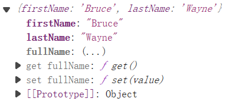

# 访问器属性：getter 和 setter

## getter 和 setter

除了常规的数据属性以外，对象还有一种属性————访问器属性。

它是用于获取和设置值的**函数**，但是从外部来看，它更像常规属性。
在对象字面量中，它们由 `get` 和 `set` 表示

```javascript
let user = {
  // getter 和 setter 在对象字面量中用 get 和 set 表示
  // 本质是函数
  get name() {
    // 当读取 user.name 时，getter 起作用
  },
  set name(value) {
    // 当执行 user.name = value 操作时，setter 起作用
  },
};
```

当读取 `user.name` 时， `getter` 起作用，当 `user.name` 被赋值时，`setter` 起作用，等号右边的值，即是 `setter` 的参数

案例：

- 已知 `user` 对象的 `firstName` ， `lastName` 得到 `fullName`。
- 已知 `fullName` 得到 `firstName` 和 `lastName`

```javascript
const user = {
  // 当读取 user.fullName 时，getter 起作用
  get fullName() {
    // 将处理好的结果 return 出去
    // return `${this.firstName}` + " " + `${this.lastName}`;
    // return `${this.firstName + " " + this.lastName}`;
    return `${this.firstName} ${this.lastName}`;
  },
  // 当执行 user.fullName = value 操作时，setter 起作用
  set fullName(value) {
    [this.firstName, this.lastName] = value.split(" ");
  },
};

user.firstName = "James";
user.lastName = "Bond";
console.log(user.fullName);

user.fullName = "Arthur Morgan";
console.log(user.firstName); // "Arthur"
console.log(user.lastName); // "Morgan"
```

::: tip
回顾：

- `str.split(delim)` 通过给定的分隔符 `delim` 将字符串分割成一个数组，并返回新数组。
- `[this.firstName, this.lastName] = value.split(" ");` 使用上述方法和解构赋值。

:::

::: tip
笔者思考：

`getter()` 语法与 Vue 框架中的 `computed` 计算属性相似，
而 `setter()` 语法与 Vue 框架中的 `watch` 侦听器相似。
:::

## 数据验证

`getter` 和 `setter` 可以用来数据验证。

例如检查输入的密码长度是否大于 6 位数，我们可以创建一个 `setter`：`password`，将值存放在一个单独的属性 `_password` 中

```javascript
const user = {
  get password() {
    return this._password;
  },
  set password(value) {
    if (value.length < 6) {
      alert("密码长度至少为6位");
    } else {
      this._password = value;
    }
  },
};

// setter
user.password = prompt("请设置您的密码：");
// getter
console.log(user.password);
```

`password` 被存储在 `_password` 中，且通过 `getter` 和 `setter` 访问。

当然我们可以使用 `user._password` 来直接访问，但以下划线 "`_`" 开头的属性是内部属性，不应该从对象外部进行访问。

如果不用变量 `_password` 来存储 `password` 会出现报错。

```javascript
let user = {
  get password() {
    return this.password;
  },
  set password(value) {
    this.password = value;
  },
};
user.password = "James";
```

`user.password = "James"` 会调用 `setter`，而 `setter` 中，`this.password` 又会调用 `getter` ...

## 访问器描述符

如数据属性一样，我们用 `Object.getOwnPropertyDescriptor` 来查询访问器描述符对象：

```js
const user = {
  // 当读取 user.fullName 时，getter 起作用
  get fullName() {
    // 将处理好的结果 return 出去
    return `${this.firstName} ${this.lastName}`;
  },
  // 当执行 user.fullName = value 操作时，setter 起作用
  set fullName(value) {
    [this.firstName, this.lastName] = value.split(" ");
  },
};

let descriptor = Object.getOwnPropertyDescriptor(user, "fullName");
console.log(descriptor);
// {enumerable: true, configurable: true, get: ƒ fullName(), set: ƒ fullName(value)}
```

访问器描述符有：

- `get` —— 一个没有参数的函数，在读取属性时工作
- `set` —— 带有一个参数的函数，当属性被设置时调用
- `enumerable` —— 与数据属性的相同，标志着该属性是否会被循环列出
- `configurable` —— 与数据属性的相同，标志着该属性是否能被删除，这些属性标志是否能被修改

访问器描述符没有 `value` 和 `writable`

所以我们可以也使用 `defineProperty` 创建访问器属性：

```js
const user = {
  firstName: "Bruce",
  lastName: "Wayne",
};

Object.defineProperty(user, "fullName", {
  get() {
    return `${this.firstName} ${this.lastName}`;
  },
  set(value) {
    [this.firstName, this.lastName] = value.split(" ");
  },
});

let descriptor = Object.getOwnPropertyDescriptor(user, "fullName");
console.log(user.fullName); // 'Bruce Wayne'
// 输出修改后的访问器描述符对象
console.log(descriptor);
// {enumerable: false, configurable: false, get: ƒ get(), set: ƒ set(value)}
```

输出 `user`



::: tip

由 `console.log(descriptor)` 的结果可知：

- 通过 `Object.defineProperty` 创建的访问器属性的标志与数据属性一样，也默认为 `false`

:::

::: warning
一个属性要么是数据属性，具有 `value` 标志，要么是访问器属性，具有 `get`/`set` 方法。但不能两者都有。

```js
const obj = {};
Object.defineProperty(obj, "prop", {
  get() {
    return 1;
  },
  value: 2,
});
// error
// Invalid property descriptor.
// Cannot both specify accessors and a value or writable attribute
```

`get/set` 不能和 `value/writable` 同时出现在同一个属性标识符对象中
:::

## 总结

- `getter` 和 `setter` 本质上是用于获取和设置值的函数，但从外部代码来看就像常规属性。
- `getter` 和 `setter` 在对象字面量中用 `get` 和 `set` 表示
- 当读取时， `getter` 起作用，当赋值时，`setter` 起作用，等号右边的值，即是 `setter` 的参数
- 避免 `getter` 和 `setter` 与已有属性重名。
