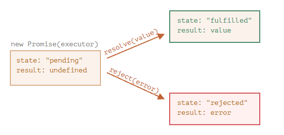

# Promise

`promise` 可以理解为是一个存放进行一系列操作后得到的结果的容器。

- 如果操作成功 —— 容器存放成功的结果
- 如果操作失败 —— 容器存放失败的信息

语法：

```js
let promise = new Promise(function (resolve, reject) {
  // executor
});
```

- `Promise` 构造函数接收一个函数作为参数，这个参数被称为 `executor`。当 `new Promise` 被创建， `executor` 会自动运行并尝试执行一项工作。
- `execctor` 的参数为两个函数，`resolve` 和 `reject` 这两个函数由 JavaScript 引擎提供
- `executor` 尝试结束后，会调用这个两个函数之一
  - 如果成功调用 `resolve(value)`
  - 如果出现 `error` 则调用 `reject(error)`

```js
let promise = new Promise(function (resolve, reject) {
  // executor
});

console.log(promise);
//[[PromiseState]]: "pending"
//[[PromiseResult]]: undefined
```

`promise` 具有两个内部属性：

- `state`: 最初为 `"padding"`，`resolve(value)` 被调用时变为 `"fulfilled"`，`reject(error)` 被调用时变为 `"rejected"`
- `result`: 最初为 `undefined`, `resolve(value)` 被调用时变为 `value`，`reject(error)` 被调用时变为 `error`

::: tip
简而言之，promise 被创建后，自动执行内部代码

- 如果成功，调用 `resolve(value)`, `state` 由 `"padding"` 变为 `"fulfilled"`, `result` 由 `undefined` 变为 `value`
- 如果失败，调用 `reject(error)`, `state` 由 `"padding"` 变为 `"rejected"`, `result` 由 `undefined` 变为 `error`
  
  :::

这里我们使用 `Math.random()` 生成 `0 ~ 1` 的随机数，如果大于等于 `0.5`，调用成功回调，否则调用失败回调。

```js
let promise = new Promise(function (resolve, reject) {
  if (Math.random() >= 0.5) {
    resolve("成功");
  } else {
    reject("失败");
  }
});

console.log(promise); // Promise {<fulfilled>: '成功'} or Promise {<rejected>: '失败'}
```

当随机数大于等于 `0.5` 时，`state` 变为 `fulfilled`，`result` 变为 `成功`。
当随机数小于 `0.5` 时，`state` 变为 `rejected`，`result` 变为 `失败`。

::: warning
`executor` 只能调用一个 `resolve` 或一个 `reject`。状态无法被再次更改。

```js
let promise = new Promise((resolve, reject) => {
  resolve('成功');

  reject('失败'); // 被忽略
  relove('成功2')；// 被忽略
})
```

:::

## then, catch

在 `promise` 得到结果或者错误后，使用 `then` 或 `catch` 做后续处理

### then

语法：`.then` 接收两个函数作为参数，

- 第一个参数是 `promise.state` 变为 `fulfilled` 并接收到结果后执行
- 第二个参数是 `promise.state` 变为 `rejected` 并接收到 error 后执行

```js
promise.then(
  function(result);
  function(error);
)
```

更改随机数案例：

```js
let promise = new Promise((resolve, reject) => {
  const num = Math.random();
  if (num >= 0.5) {
    resolve(`成功，${num}`);
  } else {
    reject(`失败，${num}`);
  }
});

promise.then(
  (result) => console.log(result),
  (error) => console.log(error)
);
```

- 当随机数大于等于 `0.5` 时，
  - `state` 变为 `fulfilled`，`result` 变为 `成功，${num}`
  - 调用 `.then` 中的第一个函数
- 当随机数小于 `0.5` 时，
  - `state` 变为 `rejected`，`result` 变为 `失败`。
  - 调用 `.then` 中的第二个函数

因为 `promise` 的状态只能被修改一次，所以只会调用 `.then` 中的一个函数而忽略另一个。

如果只在意 `fulfilled` 的情况，可忽略第二个参数

```js
let promise = new Promise((resolve, reject) => {
  const num = Math.random();
  if (num >= 0.5) {
    resolve(`成功，${num}`);
  }
});

promise.then((result) => console.log(result));
```

### catch

如果只在意 `rejected` 的情况，可以使用 `null` 作为第一个参数，也可以使用 `.catch`

语法：`.catch` 接收一个函数作为参数，`promise.state` 变为 `rejected` 后执行

```js
promise.catch((error) => console.log(error));
// 等价于
promise.then(null, (error) => console.log(error));
```

## finally

不管 promise 调用 `resolve` 还是 `rejcet` 都会进入 `finally`

`finally` 的处理程序没有参数，在 `finally` 中不知道 `promise` 的结果
`finally` 的处理程序将结果传递给下个 `thien` 或 `catch`
`finally` 的处理程序

```js
const promise = new Promise((resolve, reject) => {
  const num = Math.random().toFixed(1);
  if (num >= 0.5) {
    resolve(`成功了，${num}`);
  } else {
    reject(`失败了，${num}`);
  }
});

promise
  .finally(() => {
    // 首先执行这里
    console.log("做一些操作");
  })
  .then((res) => {
    console.log(res);
  })
  .catch((err) => {
    console.log(err);
  });
```

## 总结

- `Promise` 接收一个函数 `executor` 作为参数，当 `new Promise` 后，`executor` 会自动运行
- `new Promise` 创建的 `promise` 对象
  - 具有 `state` 属性，初始值为 `padding`
  - 具有 `result` 属性，初始值为 `undefined`
- `executor` 函数有两个参数 `resolve` 和 `reject`，`executor` 应该在适当的时候调用其中之一
  - 成功时，调用 `resolve(value)` => 将 `state` 修改为 `fulfilled`，`reslut` 修改为 `value`
  - 失败时，调用 `reject(error)` => 将 `state` 修改为 `rejected`，`result` 修改为 `error`
- `promise.then((result) => {}, (error) => {})` 接收两个函数作为参数
  - 当 `state` 修改为 `fulfilled`，`reslut` 修改为 `value` 后，调用第一个参数
  - 将 `state` 修改为 `rejected`，`result` 修改为 `error` 后，调用第二个参数
- `promise.catch((error) => {})` 接收一个函数作为参数
  - 将 `state` 修改为 `rejected`，`result` 修改为 `error` 后，调用该参数
- `promise.finally(()=>{})` 接收一个函数作为参数
  - 不管 `state` 的结果修改为何，都会调用其作为参数的函数
