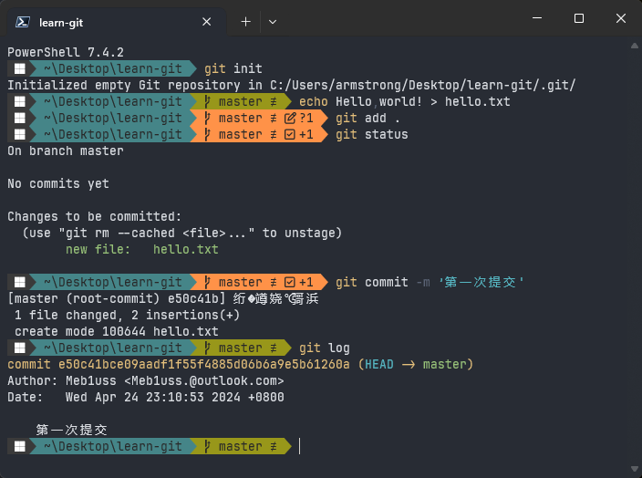
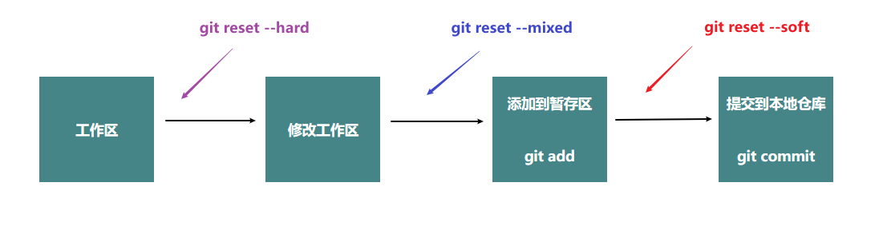

# Git 基本使用

::: tip
基本命令行指令：

- `cd ..` 进入上一级目录
- `cd 目录名` 进入指定目录

- `md newfloder` 在当前目录下创建文件夹 newfloder

- `rd` 删除文件夹
- `cls` 清空命令行窗口

- `type nul>文件名.后缀名` 创建文件
- `echo '内容' > 文件名.后缀名` 向文件中写入内容
- `echo '内容' >> 文件名.后缀名` 向文件中追加内容
- `vi 文件名.后缀` 编辑文件内容

- `ls` 查看当前文件夹内容

- `rm` 删除文件
  :::

## 初始化设置

::: tip

- `git -v` 查看 git 版本
- `git config --global user.name userName` 配置用户名为 userName
- `git config --global user.email xxxxx@xxx.com` 配置邮箱为 xxxxx@xxx.com
- `git config --global --list` 查看配置信息

:::

使用 `git -v` 查看 git 版本，接下来配置用户名和邮箱，用来记录是谁提交了文件

配置用户名
`git config --global user.name Bruce`

- 其中
  - 若省略 `--global` 则为本地配置，只对本地仓库有效
  - `--global`: 全局配置，所有仓库生效
  - `--system`：系统配置，对所有用户生效，一般不使用

配置邮箱

`git config --global user.email xxxxx@xxx.com`

如果 `user.name/user.email` 后为的字符串包含空格，则需要用引号包裹

`git config --global user.name "Bruce Wayne"`

查看配置信息

`git config --global --list`

## 新建仓库

两种方式创建仓库

- 方式一：本地直接创建仓库 `git init`
- 方式二：从远程服务器克隆一个已存在的仓库 `git clone`

`git init` 在当前目录下生成仓库

`git init xxx` 在当前目录下创建 `xxx` 文件夹，在 `xxx` 文件夹下创建仓库
等价于

```
md xxx
cd xxx
git init
```

## 工作区域和文件状态

### 工作区域

Git 本地数据管理分为三个区域

- 工作区（Working Directory）
  - 也叫工作目录或本地工作目录，资源管理器里能看到的文件夹就是工作区
  - 实际操作目录
- 暂存区（Staging Area/Index）
  - 临时存储区域，用于保存即将提交到 Git 仓库的修改内容
- 本地仓库（Local Repository）
  - 通过 `git init` 创建的仓库
  - 包含了完整的项目历史和元数据，是 Git 存储代码和版本信息的主要位置

工作区就是 `.git` 所在的目录，暂存区为 `.git/index`，本地仓库是 `.git/objects`

修改完工作区的内容后，需要通过 `git add` 添加到暂存区，最后使用 `git commit` 提交到本地仓库

`ls` 命令查看工作区内容
`git ls-files` 查看暂存区内容

### 文件状态

Git 中的文件也存在几种状态

- 未跟踪 Untrack
  - 新创建的还没被 Git 管理起来的文件
- 未修改 Unmodified
  - 已被 Git 管理，内容未被修改，未发生变化的文件
- 已修改 Modified
  - 已被修改，但还未被添加到暂存区的文件
- 已暂存 Staged
  - 修改后已被暂存的文件

## 添加和提交文件

::: tip

- `git init` —— 创建仓库
- `git status` —— 查看仓库状态
- `git add` —— 添加到暂存区
- `git commit` —— 提交暂存区中的文件到本地仓库
- `git log` —— 查看提交历史

:::

- `git init` 创建仓库
- `git.add hello.txt` 将 `hello.txt` 文件添加到暂存区
- `git status` 查看仓库状态
- `git commit -m '第一次提交` 提交暂存区的文件到本地仓库。
- `git log` 查看提交历史



`git commit -m "提交信息"`
提交信息会被记录到仓库中
如果没有提交信息，会进入一个页面，
按下 `i` 进入编辑模式，使用方向键移动光标，第一行写上提交信息，再按下 `Esc` 退出编辑模式，输入 `:wq` 保存退出。

<!--
`git commit -a` 等于 先`git add .` 再 `git commit` -->

`git add` 可选参数

- `git add *.txt` 将所有 `.txt` 后缀文件添加到暂存区
- `git add .` 将当前文件夹下的所有文件都添加到暂存区

`git commit` 参数

- `git commit -m 'msg'` 将 `msg` 作为本次提交信息

`git log --oneline` 查看精简提交历史

## 回退版本

`git reset` 三种不同类型的参数

- `git reset --soft xxxx`
  - 回退到版本 id 为 xxx 的版本，并保留工作区和暂存区的所有修改内容
- `git reset --hard xxx`
  - 回退到版本 id 为 xxx 的版本，并丢弃工作区和暂存区的所有修改内容
- `git reset --mixed xxx` (默认)
  - 回退到版本 id 为 xxx 的版本，保留工作区但丢弃暂存区的所有修改内容

`HEAD^` 表示当前版本
`git reset --soft HEAD^` —— 回退到上个版本，并保留工作区和暂存区的所有内容

理解：

- `--soft HEAD^` 回退到当前版本提交前
- `--hard HEAD^` 回退到当前版本提交前，且文件未被修改时
- `--mixed HEAD^` 回退到当前版本添加至仓库前



`git reflog` 历史操作记录

## 查看差异

`git diff`

- 查看工作区、暂存区、本地仓库之间的差异
- 查看不同版本之间的差异
- 查看不同分支之间的差异

### 比较工作区、暂存区、本地仓库之间的差异

`git diff`
默认比较工作区和暂存区之间的差异

`git diff HEAD`
比较工作区和版本库之间的差异

`git diff --catched`
比较暂存区和版本库之间的差异

### 比较不同版本的差异

`git diff id1 id2`

比较现在版本和上个版本

`git HEAD~ HEAD`
`HEAD~`/ `HEAD^` 都表示上个版本

`HEAD~2` 表示 `HEAD` 之前的倒数第二个版本

## 删除文件

1. 本地工作区删除文件 `rm file1.txt`
2. 暂存区更新 `git add file1.txt`
3. 仓库更新

`git rm file1.txt` 从本地工作区删除文件 `file1.txt` 并添加到暂存区，即把上面两步合并为一个步骤

`git rm --catched file1.txt`
把文件从暂存区删除，但保留在工作区

## .gitignore

## SSH 配置和克隆仓库

Https 把本地仓库代码 push 到远程仓库时，需要验证用户名和密码
SSH 不需要验证用户名密码，但需要在远程仓库上添加 SSH 公钥的配置

### 配置 SSH 密钥

`ssh-keygen` 创建 ssh 密钥对

`.pub` 为公钥文件
为远程仓库配置公钥

## 关联本地仓库和远程仓库

`git remote add <shortname> <url>`
添加一个远程仓库，`shortname` 为远程仓库别名，默认为 `origin`。

`git remote -v`
查看当前仓库所对应的远程仓库的别名和地址

`git push -u origin master:master`

将本地仓库和别名为 origin 的远程仓库关联，把本地仓库的 master 分支推送给远程仓库的 master

当分支名相同时，可省略`:master`

当远程仓库发生更改时，使用 `git pull`

把远程仓库的指定分支拉取到本地并合并

`git pull <远程仓库名> <远程分支名>：<本地分支名>`

默认值为 `git pull orgin master:master`

`source tree`

## 分支

`git branch` 查看当前仓库的所有分支

`git branch 分支名` 创建一个新的分支

`git checkout 分支名` 切换到不同分支

`git checkout 文件名` 将文件恢复到修改前的状态

避免文件名和分支名相同

新的切换分支命令
`git switch 分支名`

`git merge` 合并分支

`git marge xxx` 将 xxx 分支合并到当前分支，合并后会自动提交到仓库

分支被合并后依然会存在，如果需要删除

`git brance -d 分支名` 删除分支，只有当这个分支被合并后，才能用此法删除

`git brance -D 分支名` 强行删除分支

`git log --oneline --graph --decorate --all` 查看分支图

使用 `alias graph = "git log --oneline --graph --decorate --all"`
这样使用 `graph` 就可以查看分支

## 解决合并冲突

两个分支修改相同文件的内容后，合并分支会产生冲突

这时，这个文件会保留两次修改的内容，手动编辑文件，完成后重新提交，提交后会自动完成合并过程。
